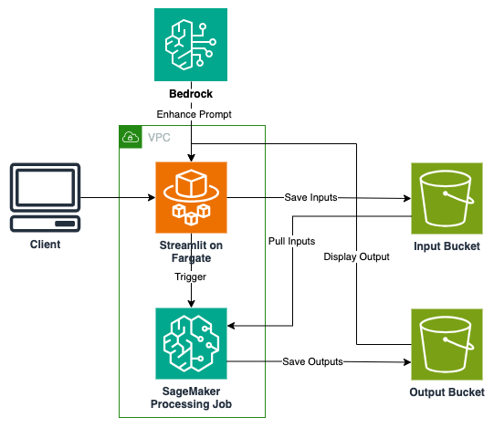

# Text-to-Video and Image-to-Video Generation on Amazon SageMaker

## Introduction

This comprehensive guide details a sophisticated AWS CDK application that deploys a Streamlit web application within the Amazon Elastic Container Service (ECS) using Fargate. The infrastructure is designed with security, scalability, and reliability at its core, incorporating various AWS services to create a robust production-ready environment. This is the codebase for the blog post 

## Architectural Overview



### Network Architecture

The networking layer is built on a robust VPC implementation that spans multiple Availability Zones for redundancy. It includes both public and private subnets, carefully configured to provide secure and efficient communication paths. The private subnets utilize NAT Gateways for controlled outbound internet access, while VPC Flow Logs provide detailed network traffic visibility for security analysis and troubleshooting.

### Data Management

The storage architecture centers around three S3 buckets: one for input videos, one for processed outputs, and a dedicated bucket for access logging. Each bucket is configured with appropriate encryption, lifecycle policies, and access controls. 

### Compute and Processing

The compute layer utilizes ECS Fargate for running the Streamlit application, eliminating the need for server management while providing automatic scaling capabilities. The Application Load Balancer distributes traffic efficiently. 

### AI/ML

SageMaker processing job handles all the video generation tasks enabling decoupling of compute to save on cost and enhance maintainability of the code. Bedrock is used to enhance user prompt leading to improved video generation outputs. The model [CogVideoX](https://huggingface.co/THUDM/CogVideoX-5b) is used to generate the video.


## Directory Structure
```
.
├── Dockerfile              # Container configuration for the Streamlit app
├── README.md               # Project documentation
├── app
│   ├── requirements.txt    # Python dependencies for Streamlit application
│   ├── streamlit_app.py    # Main Streamlit application code
│   └── test_vid.mov        # Sample video file for testing
└── infrastructure
    ├── app.py              # CDK app entry point
    ├── cdk.json            # CDK configuration
    ├── ecs_streamlit_stack.py  # Main infrastructure stack definition
    ├── requirements.txt    # Python dependencies for CDK infrastructure
    └── processing_job
        ├── inference.py         # SageMaker processing job script
        └── requirements.txt     # Dependencies for processing job
```

## Deployment Prerequisites and Process

### Prerequisites

1. **AWS CDK Toolkit**
   - Install the AWS CDK Toolkit globally using npm: `npm install -g aws-cdk`
   - This provides the core functionality for deploying infrastructure as code to AWS

2. **Docker Desktop**
   - Required for local development and testing
   - Ensures container images can be built and tested locally before deployment

3. **AWS CLI**
   - Must be installed and configured with appropriate credentials
   - Requires an AWS account with necessary permissions
   - Configure using `aws configure` with your access key and secret

4. **Python Environment**
   - Python 3.11+ installed on your system
   - Recommended to use a virtual environment for isolation
   - Required for both the CDK infrastructure and Streamlit application
5. **Active AWS account**
   - You will need to raise a service quota request for `Amazon SageMaker` -> `ml.g5.4xlarge for processing job usage`
   - You will need Bedrock model access to `Claude 3.5` 

### Deployment Steps
*Note: this solution has been tested on `us-east-1` region. 
1. **Create and activate virtual environment**
```
python -m venv .venv
source .venv/bin/activate
```
2. **Install Infrastructure Dependencies**
```
cd infrastructure
pip install -r requirements.txt
```
3. **CDK Bootstrap** (if not already done in your AWS account)
```
cdk bootstrap
```
4. **Deploy Infrastructure**
```
cdk deploy -c allowed_ips='["'$(curl -4 -s ifconfig.me)'/32"]'
```

### User Interface
To access the streamlit UI click on the `StreamlitURL` on the cdk output logs once deployment is successful.

### Clean up
```
cdk destroy
```
